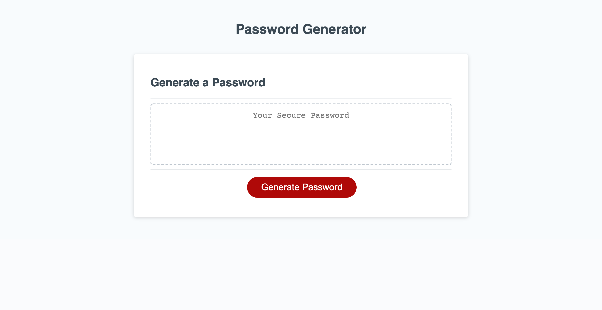
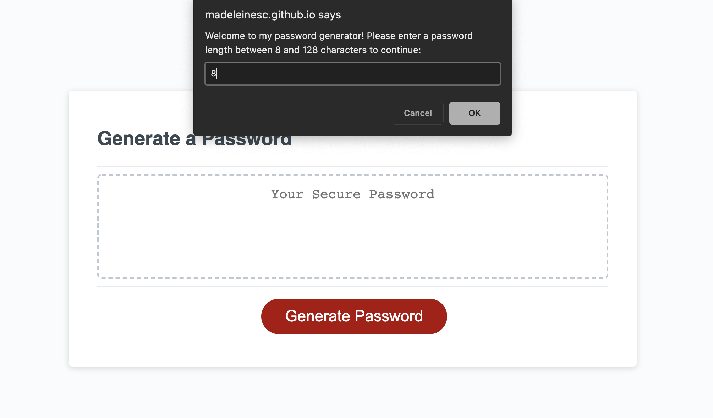
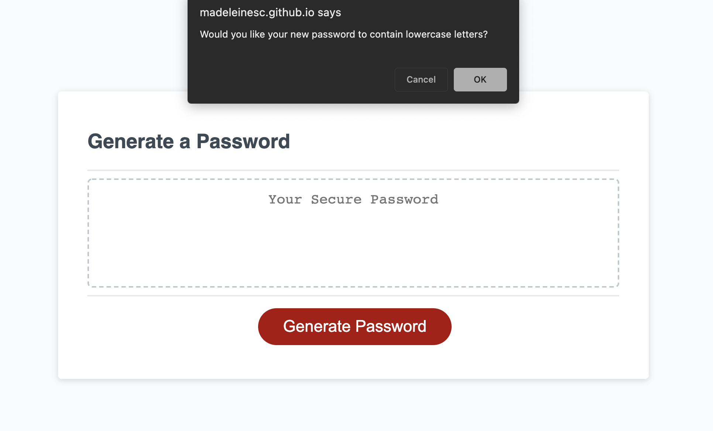
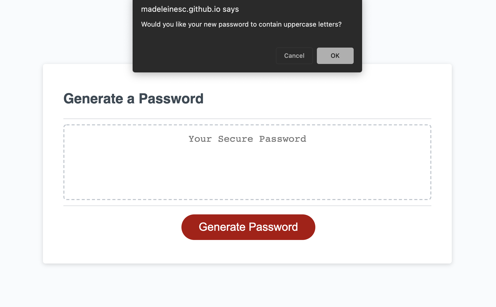
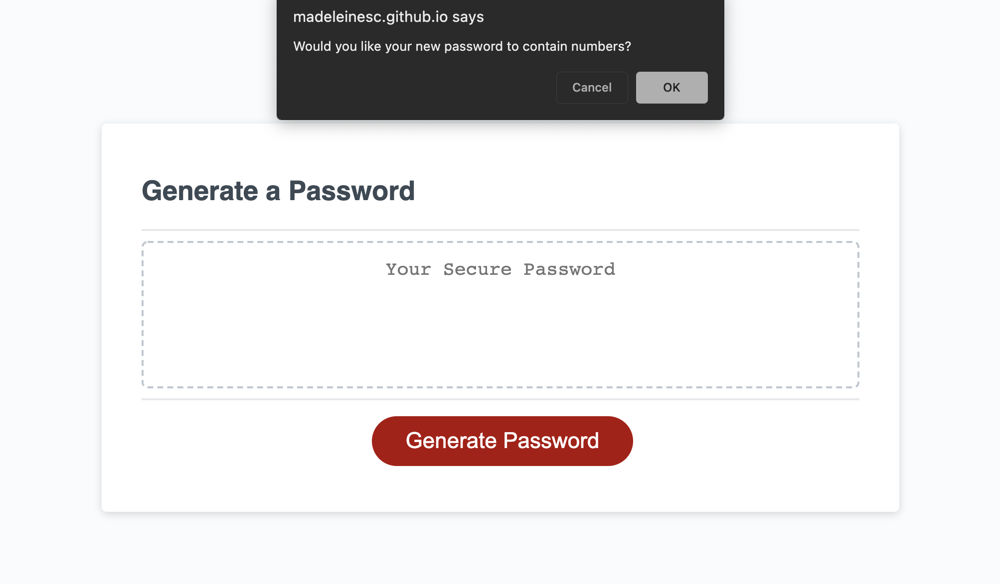
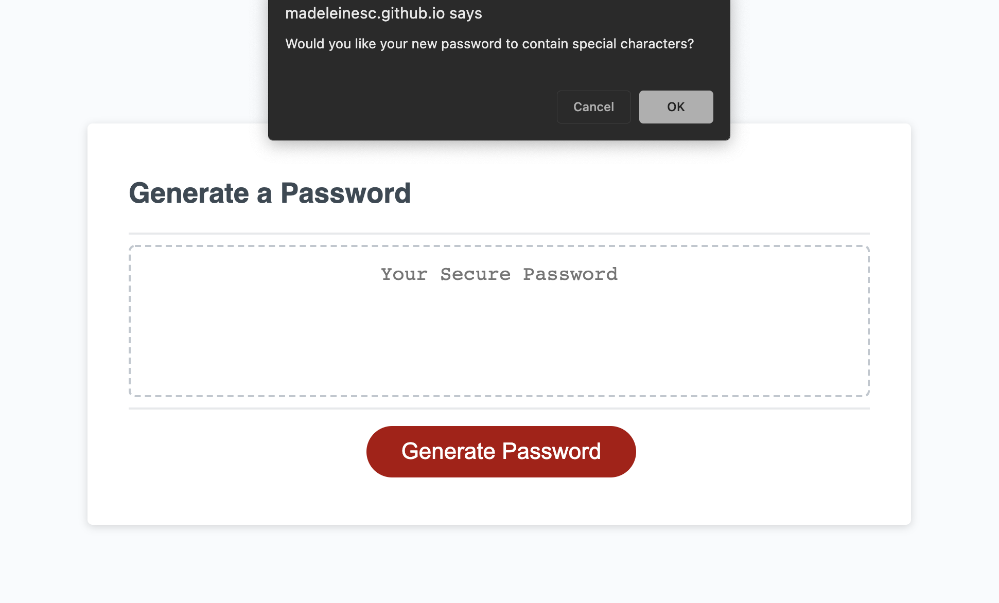
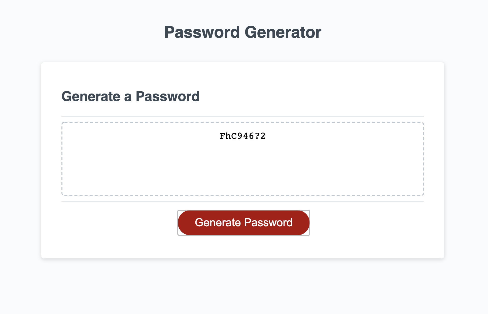
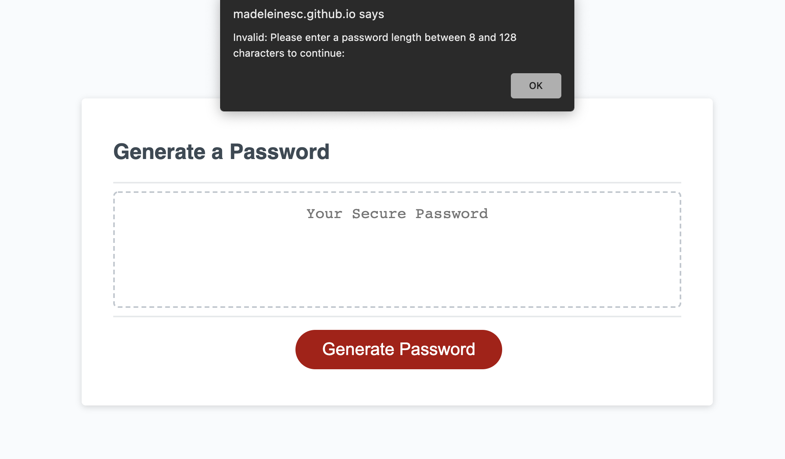
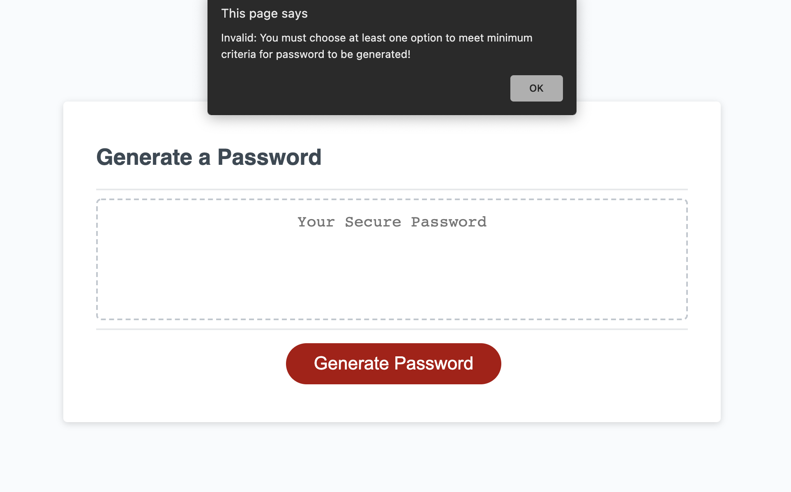

## JAVASCRIPT PASSWORD GENERATOR

# Description
For this task, I was given starter code - to modify and add to - to create a program that enables a user to generate a random password based off of the user's selections. This program is run in a web browser using HTML, CSS and Javascript code.

# User Story
AS AN employee with access to sensitive data
I WANT to randomly generate a password that meets certain criteria
SO THAT I can create a strong password that provides greater security

# Criteria
GIVEN I need a new, secure password
WHEN I click the button to generate a password
THEN I am presented with a series of prompts for password criteria
WHEN prompted for password criteria
THEN I select which criteria to include in the password
WHEN prompted for the length of the password
THEN I choose a length of at least 8 characters and no more than 128 characters
WHEN asked for character types to include in the password
THEN I confirm whether or not to include lowercase, uppercase, numeric, and/or special characters
WHEN I answer each prompt
THEN my input should be validated and at least one character type should be selected
WHEN all prompts are answered
THEN a password is generated that matches the selected criteria
WHEN the password is generated
THEN the password is either displayed in an alert or written to the page

# My password generator
When clicking on the generate password button, the user will be presented with a window prompt asking the user to input the desired length for their new password between 8 and 128 characters. The user is then asked whether they would like to include lowercase or uppercase letters as well as numbers and lastly, characters. After the prompts are answered, a password will be generated and placed in the box above the generate password button.

----

* below is the initial password generator screen the user will see:

* once the user has clicked the generate password button, a window will appear asking them to specify a length:

* the user is then asked if they want lower or uppercase letters:

* the user is then asked if they want numbers or characters:

* password is then finalised:

* if user does not input a number between 8 or 128 an alert will appear:

* if user doclines all prompts, an alert will appear:

# Final Comments
As my first time working with Javascript, I found this to be quite challenging. I think my password generator could be improved upon and perhaps simplified in future.